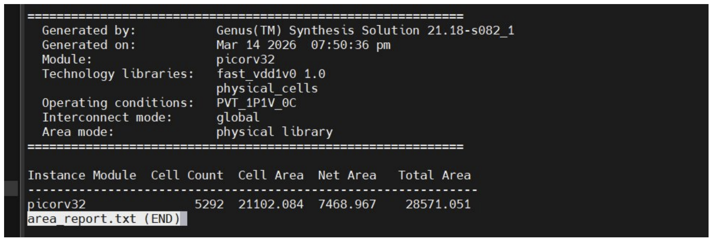
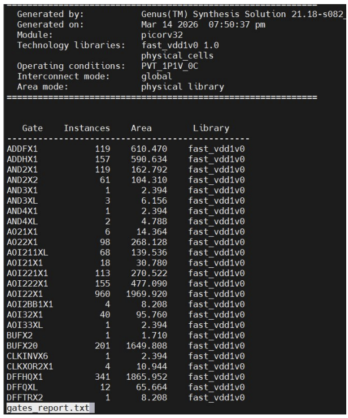
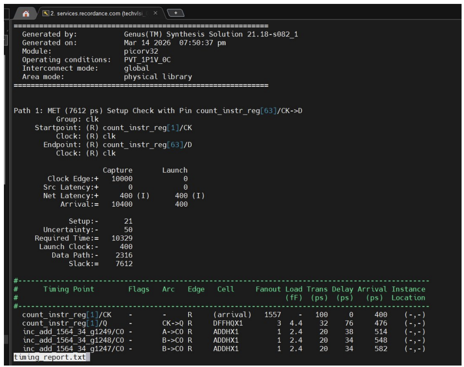
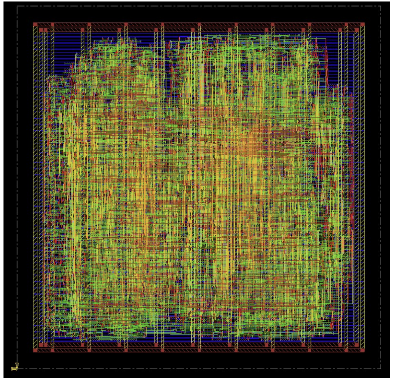
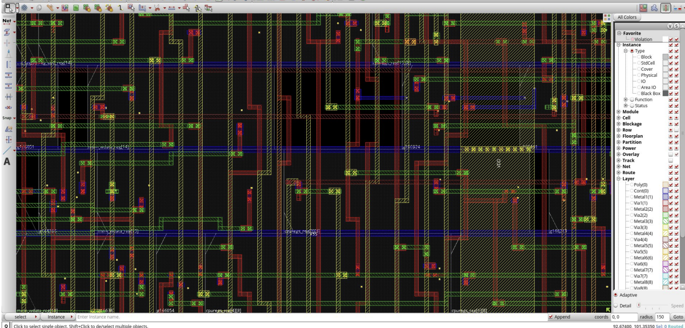

# PicoRV32 RTL-to-GDSII ASIC Implementation (Cadence 45nm)

A complete RTL-to-GDSII ASIC implementation of the PicoRV32 RISC-V CPU using Cadence Genus and Innovus in a 45nm standard cell technology, following a full digital ASIC design flow — from synthesizable Verilog RTL to a DRC-clean GDSII layout.

---

## Overview

| Parameter       | Details                          |
|----------------|----------------------------------|
| Design          | PicoRV32 (RISC-V RV32I CPU)     |
| Synthesis Tool  | Cadence Genus                    |
| P&R Tool        | Cadence Innovus                  |
| Technology      | 45nm Standard Cell Library       |
| Target Frequency| 100 MHz                          |

---

## Key Results

| Metric                  | Value         |
|-------------------------|---------------|
| Standard Cell Count     | 5,292         |
| Total Area              | 28,571 µm²    |
| Timing Slack            | +7.612 ns     |
| Estimated Max Frequency | ~419 MHz      |
| Total Power             | ~3.15 mW      |
| DRC Violations          | 0             |

---

## Design Description

The design is based on the open-source [PicoRV32](https://github.com/YosysHQ/picorv32) RISC-V core, using a compact multi-cycle architecture optimized for low area.

**Key Features:**
- 32-bit RV32I instruction set
- Sequential (non-pipelined) execution
- 32 general-purpose registers
- Valid/ready memory interface

---

## ASIC Design Flow
```
RTL (Verilog)
    ↓
Logic Synthesis (Cadence Genus)
    ↓
Gate-Level Netlist
    ↓
Floorplanning & Power Planning
    ↓
Placement & Optimization
    ↓
Clock Tree Synthesis (CTS)
    ↓
Routing
    ↓
Timing & Power Analysis
    ↓
DRC Verification
    ↓
GDSII Generation
```

---

## Synthesis Results

### Area Report


### Gate Count Analysis


### Timing Report


---

## Physical Design

### Final Layout


### Detailed Layout


---

## Project Structure
```
├── rtl/             → Verilog RTL source files
├── constraints/     → SDC timing constraints
├── synthesis/       → Netlist and synthesis outputs
├── scripts/         → TCL automation scripts
├── reports/         → Area, timing, and power reports
├── gds/             → Final GDSII layout
├── images/          → Screenshots used in README
└── docs/            → Full project report
```

---

## References

- PicoRV32 Open-Source Core: https://github.com/YosysHQ/picorv32

---

## Author

**Siam Al Shafin**  
Undergraduate Student, Islamic University of Technology (IUT)

---

## Notes

This project demonstrates a complete RTL-to-GDSII ASIC flow using industry-standard EDA tools (Cadence Genus and Innovus) on a real open-source RISC-V processor design.
